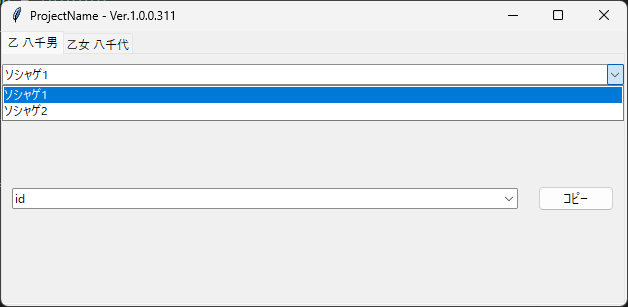

# TableClipper
- [TableClipper](#tableclipper)
  - [TableClipperとは](#tableclipperとは)
    - [作成環境](#作成環境)
    - [免責事項](#免責事項)
  - [前提](#前提)
  - [準備](#準備)
    - [JSONファイルについて](#jsonファイルについて)
    - [アプリケーションのタイトルを変更する](#アプリケーションのタイトルを変更する)
    - [生成されるexeの名前を変更する](#生成されるexeの名前を変更する)
    - [コピーする文字列を登録する](#コピーする文字列を登録する)
      - [1階層レイアウト](#1階層レイアウト)
      - [2階層レイアウト](#2階層レイアウト)
      - [3階層レイアウト](#3階層レイアウト)
    - [実行](#実行)
  - [最後に](#最後に)

## TableClipperとは
よく使う文字列を辞書形式の`JSON`ファイルを用いてクリップボードにセットするためのGUIアプリケーションです。  
用意するJSONファイルの構造によって３種類のレイアウトを選択可能です。

### 作成環境
- Windows11 64bit
- Python3.11

これ以外の環境で動作するかのテストは行えておりません。  

### 免責事項
このソフトウェアは「現状のまま」提供され、明示的または黙示的ないかなる保証もありません。著作権者やコントリビュータは、ソフトウェアの使用に起因するいかなる損害についても一切責任を負いません。
再配布はご遠慮ください。  

## 前提
- `Python3.11`がインストールされていない場合は、あらかじめインストールするようにしてください。
    - コマンドラインツールで`py -V`を実行したとき、`Python 3.11.*`(`*`は任意の数字)が出力されればOKです。
- Pythonライブラリ`pipenv`が必要になります。
  - `pipenv -h`を実行したとき、使用方法が出力されなければ`pip install pipenv`を実行してみてください。

## 準備
まず、このページ右にあるReleaseから任意のバージョンの`zipファイル`をダウンロードして解凍してください。  
**解凍ソフトの設定によっては`zipファイルと同じフォルダ`に中身がぶちまけられます。**  
解凍ソフトでファイル名と同一のフォルダ内に展開する設定をしている自信がない場合は仮フォルダ上で展開することをお勧めします。  
  
コマンドの実行はすべて解凍したフォルダ`./`で行います。  

手始めに`pipenv sync -d`を実行してみてください。  
このプログラムに必要なサードパーティ製ライブラリが仮想環境にインストールされます。  

操作の必要があるファイルは以下の通りです。  
また`exe生成ファイル`は2通りあるので一纏めに`buildファイル`と呼びます。  

これ以外のファイルを開いたり、テキストエディタで確認しても構いませんが、  
変更したりファイルを移動等させた場合には正常に実行可能ファイルが作成できなくなります。

場所|ファイル名|概要
:--:|:--:|:--:
./|build.bat|コマンドプロンプト用`exe生成ファイル`
./|build.ps1|Powershell用`exe生成ファイル`
./|Project.spec|`exe`生成用設定ファイル
./InternalData|ProjectData.json|プログラム管理ファイル
./InternalData|Table.json|コピーするデータを管理します。

### JSONファイルについて
<details>
<summary>JSONファイルなにそれって方は目を通しておいてください。</summary><br>
JSONファイルは決まった形を守らないと正常に読み込むことができません。<br>
そこでこの説明で使用する言葉だけ統一しておきたいと思います。<br>
**あくまで説明のために勝手に呼ぶだけなので、正式名称を保証するものではありません。**  

今回使用するJSONファイルは辞書形式と呼ばれるものです。<br>
`{}`の間に`"キー": "値"`というデータを任意の個数設定したものです。<br>
`"キー": "値"`のことを`キーセット`として説明します。<br>
`{キーセット1, キーセット2, ...}`の用に複数のキーセットを設定するには`"値"`の後ろに`,`を付ければよいですが、`最後のキーセット`と`}`の間に`,`を付けてはいけません。<br>
`キー`と`値`の間には`:`が必要で、`キー`と`値`はそれぞれ`"`で囲まれている必要があります。<br>
`'`と`"`は区別されてしまうので注意してください。<br>
また値に`"`を使用したい場合は`\"`とすることで使用することができます。<br>

値にはさらに辞書を設定することができ、ここでは`階層`として説明します。<br>

レイアウト紹介の際にサンプルを表示するので、それも参考にしてください。
</details>

### アプリケーションのタイトルを変更する
この工程は基本機能さえ使えればよいのであれば不要です。  
`ProjectData.json`をテキストエディタ等で開いてください。  
`JSONファイル`の理解ができるようになっていれば`NAME`, `VERSION`, `SCRIPT_VERSION`という3つのキーを持つ辞書であると理解できるかと思います。  
自由に変更できるのは`NAME`と`VERSION`の`値`です。  
この二つを設定することで`<設定したNAME> - Ver.<設定したVERSION>`という具合にアプリケーションのタイトルが変わります。  
**不要だからとキーセットを削除すると動かなくなります。**  

### 生成されるexeの名前を変更する
この工程は基本機能さえ使えればよいのであれば不要です。  
`Project.spec`をテキストエディタ等で開いてください。  
このファイルの`35行目`が`name='ProjectName'`となっているかと思います。  
`'`で囲まれた部分を変更することで`<設定した名前>.exe`という実行可能ファイルが生成されるようになります。  

次に`buildファイル`をテキストエディタ等で開いてください。  
変更するのは`2行目`です。  
`.\dist\ProjectName.exe .\`のようになっているかと思います。  
`ProjectName`の部分を`Project.spec`で設定した名前と一致するようにしてください。  
`name='Sample'`ならば`.\dist\Sample.exe`です。  
末尾の`.\`が実行可能ファイルの生成先です。  
必要に応じて変更してください。  

### コピーする文字列を登録する
この工程は必ず行う必要があります。  
`Table.json`をテキストエディタ等で開いてください。  
変更していなければ空の辞書形式になっていると思います。  
以下で紹介するレイアウトを参考に好きな文字列を登録してください。  
参考画像はスクリーンショットの為にウィンドウサイズが変更されています。  

#### 1階層レイアウト
このプログラムの基本形です。  
選択したキーに対応する値がクリップボードにセットされます。  

```json

{
    "乙 八千男": "乙 八千男",
    "読み": "Otsu Hachio",
    "性別": "男",
    "年齢": "28"
}
```


#### 2階層レイアウト
1階層レイアウトから発展して分別できるようになりました。  

```json
{
    "乙 八千男": {
        "名前": "乙 八千男",
        "読み": "Otsu Hachio",
        "性別": "男",
        "年齢": "28"
    },
    "乙女 八千代": {
        "名前": "乙女 八千代",
        "読み": "Otome Yachiyo",
        "性別": "女",
        "年齢": "25",
        "趣味": "音楽"
    }
}
```


#### 3階層レイアウト
2階層レイアウトからさらに発展して、タブが付くようになりました。  
アカウント情報をコピーできるように平文登録する。  
セキュリティリスク度外視の非推奨な使い方です。  
例としてはわかりやすい方かと思うので採用しています。  

```json

{
    "乙 八千男": {
        "ソシャゲ1": {
            "id": "sg_id1",
            "password": "sg_password1"
        },
        "ソシャゲ2": {
            "id": "sg_id2",
            "password": "sg_password2"
        }
    },
    "乙女 八千代": {
        "フリマ": {
            "id": "frema_id",
            "password": "frema_password"
        }
    }
}
```



**キーセット毎に異なる階層数を採用することはできません。**

### 実行
実行するには`pipenv run py main.py`とコマンドする方法と実行ファイルを生成してダブルクリックする方法があります。  
Powershellなら`.ps1`、コマンドプロンプトなら`.bat`の拡張子を持つ`buildファイル`を実行すれば勝手に生成されるはずです。  
もし実行できないなら対応する`buildファイル`をテキストエディタ等で開いて上から1行ずつ実行すればできるかと思います。  

## 最後に
なるべくわかりやすく書きたかったのですが、初心者で興味を持ってくれた人でも無事使えるようにできたでしょうか？  

各種ファイルを書き換えてから再生成することで複数のTableClipperを作ることができます。  
上書きしないようにその都度exeファイルの名前を変えることだけ気を付けてゲーム用、プログラム用なんて複数種類用意したり楽していただけると幸いです。  
もし導入でわかりにくいこととかあったら気軽に[ブログ](https://otsuhachi.hatenablog.jp/)とかで聞いてください。  
可能な範囲でお答えします。
